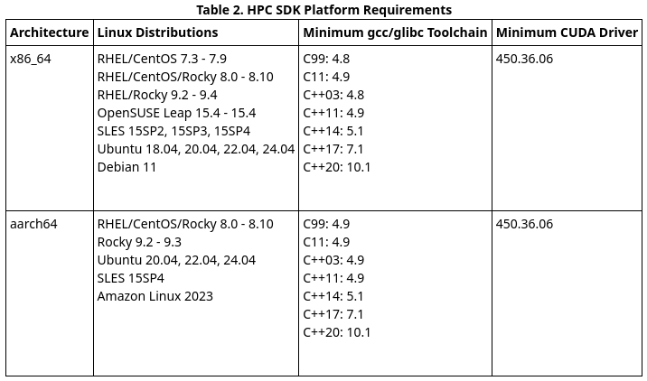

# StreamsML
StreamsML is a control, modeling, and analysis platform for compressible flow simulations that couples a Python/Gymnasium interface with the STREAmS solver (https://github.com/matteobernardini/STREAmS). StreamsML adds a fully customizable jet actuator to a simulation of high-speed boundary layer flow, allowing the user to test their own control strategies, including open-loop, classical, and machine-learning based strategies, in addition to reduced-order modeling methods and analysis methods.

### Motivation
Modern flow-control research often requires combining high-fidelity simulations capable of simulating high-speed flow that are compatible with new control methods, such as machine learning, with reproducible environments and HPC tooling. StreamsML was built to make those workflows more standardized and easier to run. With it, you can:
- Run boundary-layer flow simulations, with and without impinging shock, using existing open-loop, classical, or machine learning-based control methods, or add your own. 
- Perform proper orthogonal decomposition (POD), dynamic mode decomposition with (DMDc) or without (DMD) control, or add your own modeling and analysis tools. 
- Visualize the flow via an animation or snapshot.
- Plot select flow characteristics like wall shear stress or energy

### Repository structure
- `streams/` — solver-related code
- `streams-utils/` — build/run/distribution utilities
- `install_dependencies.sh` — environment bootstrap script

### Personal Contributions
The original STREAmS solver was written in Fortran and lacked an actuator or control method. Work had been done by a former graduate student to modify STREAmS with a jet actuator and open loop control, though due to version drift the software could not be built when I began working on the project. My contributions are listed below:
- Updated and pinned software in build process
- Added reproducible utilities for setup and execution
- Re-wrapped Fortran routines in Python and extended their functionality
- Created a Python-based control experimentation workflow for machine learning as well as non-learning based control strategies.
- Created a Python-based modeling and analysis experimentation workflow

## User Instructions

The instructions below guide the user in building, configuring, and running a simulation using a pre-existing control strategy. Instruction on how to run pre-existing modeling, analysis, and visualization routines as well as how to add your own control, modeling, and analysis methods can be found in the [Detailed user instructions (PDF)](streams/svgs/StreamsMLmanual.pdf). 

All user actions in the following instructions take place in the streams-utils subdirectory of StreamsML.

## Software Build Instructions

> - Setup  
>   - Check your OS' minimum CUDA driver requirements  
>   - Execute install_dependencies.sh to add required paths to your bash file, create a virtual environment, and install local software dependencies therein.  
> - Build  
>   - Sequentially run "just nv", "just base", "just build" to create the final streams.sif container in which the software will run.
##

### Setup

> **After checking the system requirements below, clone the StreamsML repository**
>
> ```bash
> git clone https://github.com/Fluid-Dynamics-Group/StreamsML.git --depth 1
> ```
>
> **Then add paths to the two directories within StreamsML into your bashrc, sourcing your bashrc file afterwards to apply the changes**
>
> ```bash
> export STREAMS_DIR="/path/to/your/streams"
> export STREAMS_UTILS_DIR="/path/to/your/streams-utils"
> ```
>
> **Next, execute install_dependencies.sh to create a virtual environment and install dependencies.**
>
> ```bash
> chmod +x install_dependencies.sh
> bash install_dependencies.sh
> ```
>
> **Note: executing the bash file should install Apptainer, but if you encounter trouble, please reference Apptainer's online documentation and install it directly from Apptainer**
>
> ```
> https://apptainer.org/docs/admin/main/installation.html
> ```

**Components of modSTREAmS build:**

- NVIDIA HPC SDK: A docker image, provided by Nvidia, to contain the libraries and tools required for GPU-accelerated, portable HPC modeling and simulation applications.
- base.apptainer: An apptainer image used to install required software, such as PyTorch, h5py, and an Ubuntu OS.
- build.apptainer: An apptainer image used to compile the Fortran and Rust code, and bind the Python code to the built streams.sif container.

**System Requirements**  
In order to use Nvidia HPC SDK, version 24.7-devel-cuda_multi-ubuntu22.04, the following requirements must be met:



Complete tag information can be found at https://docs.nvidia.com/hpc-sdk/archive/24.7/hpc-sdk-release-notes/index.html  
Other tags can be found here: https://catalog.ngc.nvidia.com/orgs/nvidia/containers/nvhpc/tags

### Build

Now that the setup has been completed, the remaining build becomes a simple sequence of three terminal commands.

> **From the streams-utils directory, run the following commands:**
>
> ```bash
> just nv
> just base
> just build
> ```

after which the software is built and all further interaction with the software is completed by editing the parameters in the Justfile, a document found in that same streams-utils directory.

## Configuring and Running a Standard Simulation

> - Configuring and running  a standard simulation  
>   - Edit the config recipe of the justfile, selecting simulation type, control type, and all parameters related to the two.  
>   - Copy the relevant config recipe found in the **JustfileExamples** folder to efficiently collect the flags required for your simulation and control type.  
>   - Type "just help tree" for all possible arguments of a given recipe and the use of each flag  
>   - Run "just config" to generate the necessary files for the run using the flags from the config recipe  
> - Run  
>   - Start the simulation with "just run"
##

### Configuring and Running a Standard Simulation

The first decision to make is whether you would like to run a simulation of a boundary layer (BL) flow or shock-boundary layer interaction flow (SBLI).

> Uncomment the option you would like to run, around lines 36-37.
>
> ```text
> # streams_flow_type := "shock-boundary-layer"
> # streams_flow_type := "boundary-layer"
> ```

Next, the config section, the heart of the user interface where simulation and control method parameters are selected. As seen below, there are two offset columns of options. The first contains options pertaining to configuring the simulation itself, such as the mach number and grid specifications, and the second has options pertaining to the control method, which itself is specified at the interface of the two columns, here seen to be learning-based ddpg.

The first column of options are used for all simulations. As previously mentioned, the control strategy (here learning-based) and method (here ddpg) are selected at the interface of the first and second columns. There are three control strategy groups (open-loop, classical, and learning-based) and within each there are a certain number of algorithms that may be chosen. For example, learning-based has the control strategies of ddpg, ppo, and dqn available. The control method and control strategy determine the options the second column is required to contain.

> Populate the config recipe of the justfile with flags and values corresponding to the simulation you would like to run

**Please see the justfile examples folder for a comprehensive set of configuration templates.**

```text
config:
	echo {{config_output}}

	# 600, 208, 100

	cargo r -- \
		config-generator {{config_output}} {{streams_flow_type}} \
		--steps 6 \
		--reynolds-number 250 \
		--mach-number 2.28 \
		--x-divisions 600 \
		--y-divisions 208 \
            ...
		--use-python \
		--nymax-wr 201 \
		--sensor-threshold 0.1 \
		learning-based ddpg \
		    --slot-start 100 \
		    --slot-end 149 \
		    --train-episodes 2 \
		    --training-output {{training}} \
		    --eval-episodes 2 \
		    --eval-max-steps 6 \
		    --eval-output {{eval}} \
		    --checkpoint-interval 5 \
		    --checkpoint-dir {{checkpoint}} \
		    --seed 42 \
		    --amplitude 1.0 \
		    --learning-rate 0.0003 \
		    --gamma 0.99 \
		    --tau 0.005 \
		    --buffer-size 100000
```

> **After you have selected your preferred simulation and control parameters in the justfile, return to the terminal and run**
>
> ```bash
> just config
> ```
>
> **The simulation has been configured and can now be run by running**
>
> ```bash
> just run
> ```
>
> **in the terminal.**
